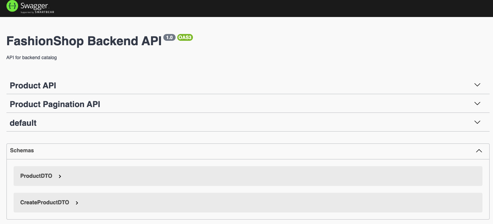
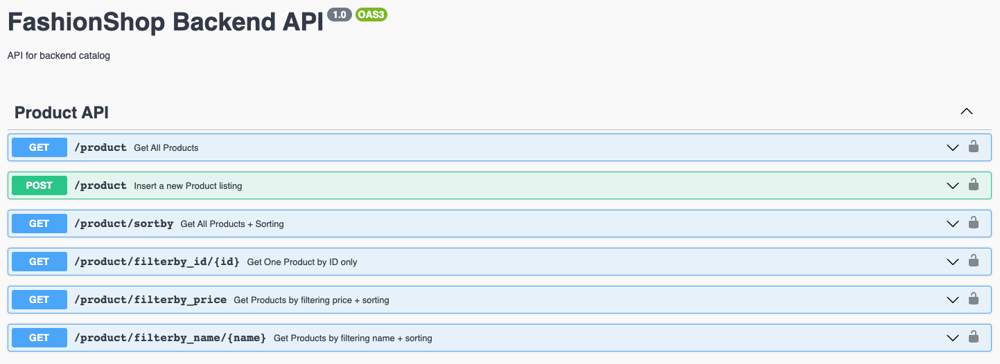
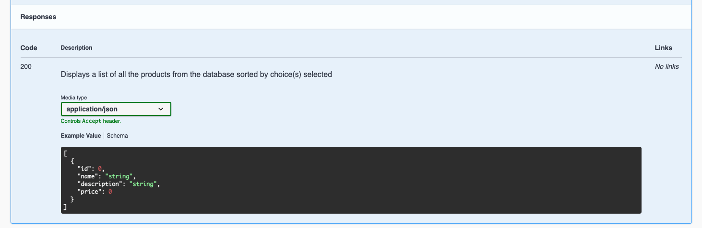
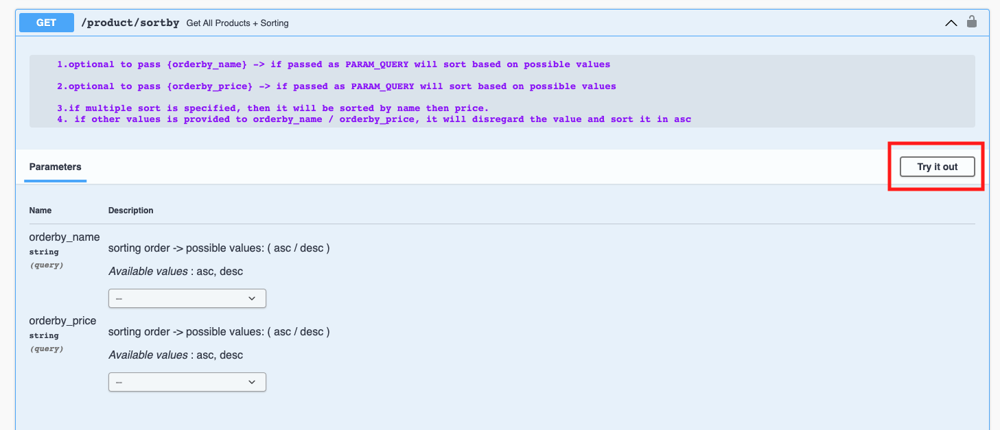
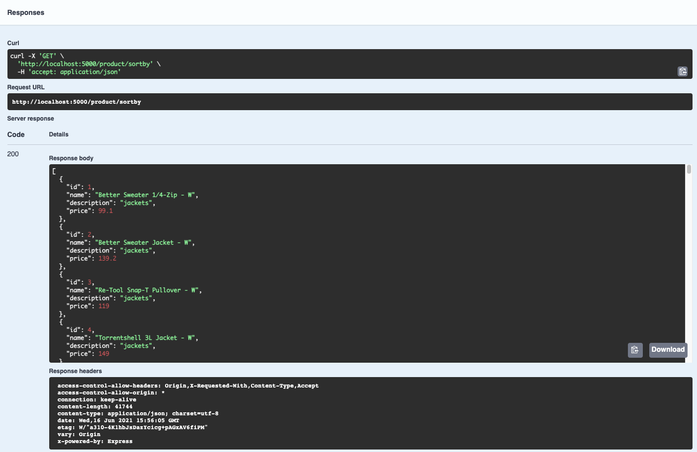

# Swagger API

Swagger API is a powerful framework which helps to dynamically add / update the API accordingly when changes are made to them.

## How to start swagger application ?

Swagger API is built into the project so starting the application is required in order to view the swagger API for testing or reading the swagger documentation.

1. You have to [start the application](../getting-started-1/untitled.md) first.
2. navigate to this directory: [http://localhost:5000/swagger-ui/](http://localhost:5000/swagger-ui/)
3. Should be welcome with this screen

## How to start viewing the documentation ?

Toggle any of the Title to open a dropdown. It will show the list of API's and show more documentation and details as to how to use the API.

**Click on any of them to test out the API.**  
Here it will show the API query that is required to be passed. the dropdown will show the possible values. this is not available for each and every query but only specific to some.

Scrolling down further, it will show the possible responses and example object which is shown when data is successfully executed.

## How to start using the API for testing ?

After picking any API and opening its content details. you can click on "try it out" button. 

Follow the instructions coloured in purple and meet the criteria based on the instruction. If done correctly, the responses tab below will update to reveal the data retrieved from the database.

**Result from the execution**

The api url + how the execution via the url is shown and the developers can use this API on the frontend.

