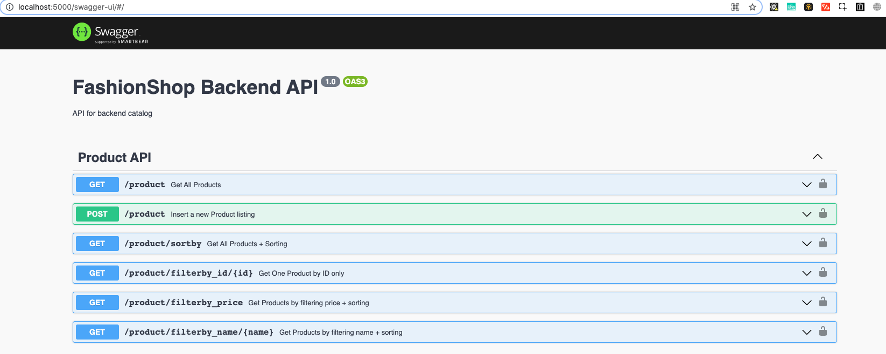

# Project Configuration

## JSON Structure

The JSON structure of the "default.js" file is broken down into four parts:

* **app** - stores the configuration required to be used generally for the application 
* **db -** store the configuration required to be used for the app to connect to database
* **dataset\_filename -** the dataset which will be used for the insertion script for the project
* **swaggerOptions -** the endpoint test API configuration page

These contents are injected into the project at runtime, rendering the values over here.

```javascript
module.exports = {
    app : {
        port : 5000
    },
    db: {
        host: "localhost",
        port : 3306,
        /* change your username */
        username :  "root",
        /* change your password */
        password : "rootroot",
        database : "fashionshop"
    },
    dataset_filename : "clothing_dataset.csv",
    swaggerOptions : {
        title : "FashionShop Backend API",
        description : "API Endpoints for backend catalog",
        version: "1.0",
        product_api : "Product API",
        pagination_api : "Product Pagination API",
        swagger_api_url : "swagger-ui",
    }
}
```


 **Example:** To change the port number of the project setup change the value 5000 to another value.


### **SwaggerOptions**

**Configuring Swagger API options in fashionshop.**



Swagger is a feature added to allow us to test API endpoints dynamically. Whenever new backend api endpoint's are created, swagger framework will pick it up and insert the API endpoint into the swagger API page in order for us to test it. The image above is the example when you successfully run swagger that you will be able to see this page above.

Making changes to swagger API is through the swaggerOptions JSON. Here is the list of details for each JSON key : value pair in the swaggerOptions.

|  |  |
| :--- | :--- |
| Title | the title of the backend api project |
| Description | the description of the backend api project |
| Version | displays the current version |
| product\_api | displays all the product api that falls under the product api |
| pagination\_api | displays all the pagination api that falls under pagination api |
| swagger\__api_\_url __ | the api endpoint which the swagger UI will be rendered on |

## Setup Configuration File in Project

This is meant as an additional info and not entirely required to the project but if you would like to know how to setup the configuration file in the project in more detail you can navigate to the link below.

[youtube link](https://www.youtube.com/watch?v=vi17cFQFQHM) to understanding on how to setup configuration file. 

