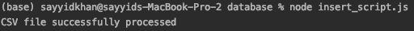

# Getting Started

### Get the project from Github

clone the project from github on to your computer.

```bash
git clone https://github.com/sayyidkhan/fashionshop_backend
```

### Software Requirements - Before Setup the project

* MySQL installed on your computer
* Node.JS installed on your computer
* Any IDE of your choice

### Project Setup - Before running the Software

We have to perform a series of installation and preparation of the system before we start using the software.

1**.Navigate into the folder directory "fashionshop\_backend" and start a terminal or command line on the directory.**

2.**Ensure that you have Node.js installed on your computer. It is recommended that you use Node.js version 12.xx as this was the Node.js which was used to setup the project.**  
[Click here to navigate to the "install node version manager" page](../misc/install-node-version-manager.md)_\(link will not open in new tab\)_

3. **Navigate into the config directory and open "default.js" file on the terminal or IDE.**

* **Directory path:** config/
* **File Path:** default.js
* Change your **username** and **password** in this file to your own mysql username and password used on your computer
* ensure the database **fashionshop** is not used throughout the project otherwise you may choose to change it here.
* save the file before continuing with the other steps.

```javascript
module.exports = {
    app : {
        port : 5000
    },
    db: {
        host: "localhost",
        port : 3306,
        /* change your username */
        username :  "root",
        /* change your password */
        password : "rootroot",
        database : "fashionshop"
    },
    dataset_filename : "clothing_dataset.csv",
    swaggerOptions : {
        title : "FashionShop Backend API",
        description : "API Endpoints for backend catalog",
        version: "1.0",
        product_api : "Product API",
        pagination_api : "Product Pagination API",
        swagger_api_url : "swagger-ui",
    }
}
```

4. **proceed to navigate into the database directory using the command line and run "insert\_script.js"  
this will initialise the database.**

* **Directory path:** database/
* **File Path:** insert\_script.js
* run the command below to **create table product** & **insert 500 records** into the table

```bash
node insert_script.js
```

* Once the process is successful, the response image should look like as shown below.



* terminate the command CTRL + C

_This will delete any existing fashionshop database and re-create a new one then inserting the 500 records into the database. You may re-run this command again in the future to re-initalise the records again._


_**You have successfully setup the environment in order for you to run the fashionshop backend api project. Navigate to**_ 

