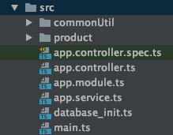
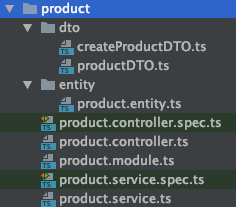

# Folder Structure

## Folder Structure For Project

There are 5 important directory to consider for this folder structure for this project.

* **src/** - main application files to start the project will be stored here
* **src/product -** the folder to store the family of files related to the product table
* **src/product/dto -** to store all the DTO files
* **src/product/entity -** the class files for the product table
* **src/commonUtil -** the global functions which can be used throughout the project will be stored here

**Folder Structure from src directory**

All items related to one table will be stored in one folder with the exception of the "app.\*.ts" files.

**Folder Structure from product folder**

**Folder structure will be as follows:**

* DTO files are stored in the dto directory
* Entity files are stored in the entity directory

Since the table name is **product** we consolidate all the product details into the product directory and repeat this process when there is another new table to be added.

|  |  |
| :--- | :--- |
| product.controller.ts | controller layer providing the endpoint API |
| product.module.ts | the file which ties the controller & service files with the main project |
| product.service.ts | the database layer allowing to write queries to retrieving result from database |
| dto/productDTO.ts | data transfer object - it provides form to the data transferred across the network |
| entity/product.entity.ts | entity files are files which define the class object |

