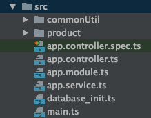
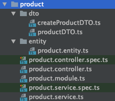
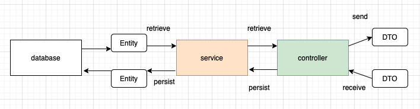

# Software Design

### Technology stack used in this project

* **Nest.JS - Node.Js backend Framework**  

  

* **Jest - Node.Js Testcases**  

  

* **Swagger - Dynamic API Documentation Generator**  

  

* **MySQL - Database used for this project**  

  

### Folder Structure For Project

**Folder Structure from src directory**

All items related to one table will be stored in one folder with the exception of the "app.\*.ts" files.

**Folder Structure from product folder**

Folder structure will be as follows:

* DTO files are stored in the dto directory
* Entity files are stored in the entity directory

**Name of table: product**

|  |  |
| :--- | :--- |
| product.controller.ts | controller layer providing the endpoint API |
| product.module.ts | the file which ties the controller & service files with the main project |
| product.service.ts | the database layer allowing to write queries to retrieving result from database |
| dto/productDTO.ts | data transfer object - it provides form to the data transferred across the network |
| entity/product.entity.ts | entity files are files which define the class object |

### Data Flow from Database to Controller Layer

**General Data Flow**  
  
This is the general high level overview how data flows and passed from each object to another.  
****

**Class Diagram For Product API**

The data flow will be depicted using class **class diagram.**

  
**Class Diagram For Product Pagination API**

\*\*\*\*

