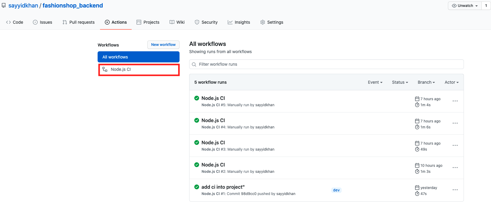
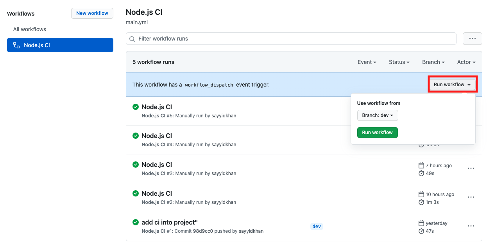
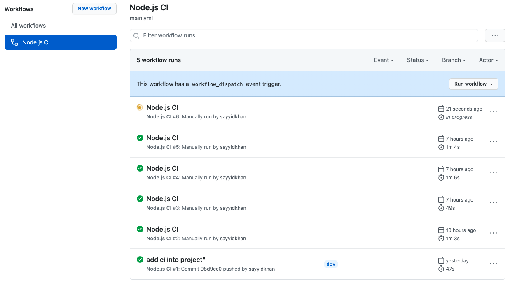
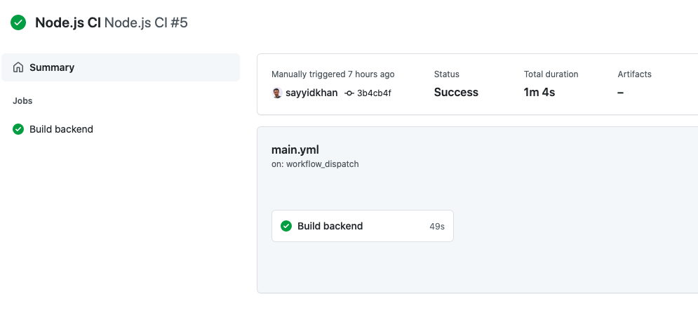
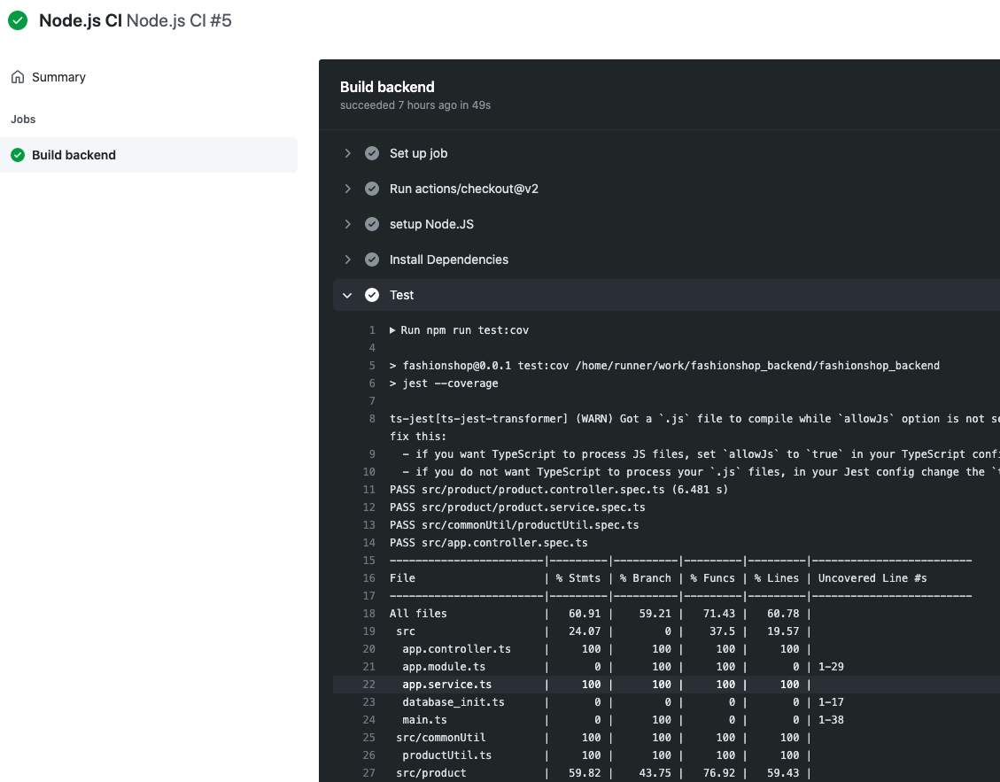

# Run Testcases using CI

To perform this feature, you will either need to fork this project repository or if u have access to the project's repository you will be able to run testcases using github CI. 

## Running Testcases using Github CI

1.**Navigate to "Actions" tab.**

2. **Click on Node.js CI**

2. **Click on Node.js CI**

3. **Click on the branch the would like to be run. After clicking on run a new job will appear.**

Pending jobs will be displayed in orange.  Failed jobs will change to red in color and green colored jobs are successful testing.

4. We can click on the title to view the details of the successful test on CI.

**Click on "build Backend"**

**Click on "test" to view the outcome**


To make changes to the CI build visit the [CI configuration](../configuration/ci-configuration.md) page.


